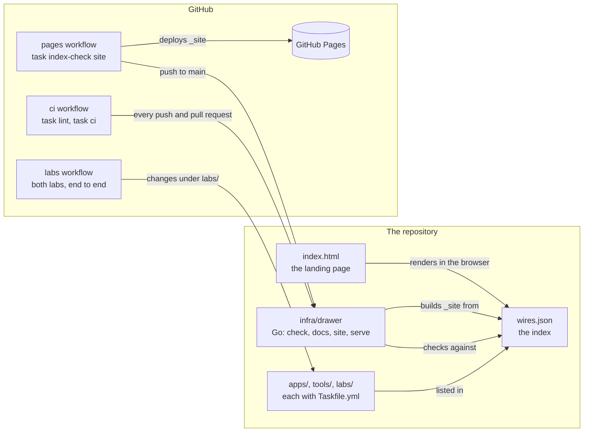

# Architecture

How the repository is put together: the projects, the drawer that indexes
them, and the workflows that test and publish them. Each lab has its own
architecture in [../labs/docs/architecture.md](../labs/docs/architecture.md).

## Overview

## The projects

| Folder | Holds | Example |
|---|---|---|
| `apps/` | Static web apps, published as they are | spillelista |
| `tools/` | Go command-line tools; their page has downloads | skill-audit |
| `labs/` | Environments to run things in: containers, clusters, or a game project for Claude | acme-env, talos-cluster, roblox-gdd |
| `infra/` | The repository's own plumbing; not in the drawer | drawer |
| `templates/` | What `task new-go` copies | go-cli |

Every project has a `Taskfile.yml` with a `ci` task, and is included in the
root `Taskfile.yml`, so its tasks run from the root as `project:task`.

## The drawer

`wires.json` lists every project under `apps/`, `tools/` and `labs/`, with
its kind, a one-line blurb and the `href` of its page. Three things read
it:

| Reader | What it does |
|---|---|
| `index.html` | The landing page fetches it and draws one wire per project, linked to its page |
| `drawer check` | Fails when a project is missing from it, an entry is wrong, or a page is missing |
| `drawer site` | Builds `_site/`: the landing page, every page, every app, and every Go tool's binaries |

`drawer site` copies each app's folder whole, and from a tool or a lab only
the `index.html` of its page. Every page is in the shape of
`tools/skill-audit/index.html`, styled by `assets/wire.css`: what the wire
is, why, what you get, real output, how to plug it in and use it. For a Go tool it builds binaries for Linux, macOS and Windows,
with a `SHA256SUMS`, into the page's `dl/`. Source files are not published.

## Tasks and scripts

A `Taskfile.yml` lists commands. A task with any logic calls a script in
`bin/`, one per task, written in the style of the
[bash-style](https://git.dataverket.org/dataverket/skills) skill. Shared
functions are in `bin/functions.sh`; the two labs share `labs/lab.sh`. The
Go tools keep their logic in Go and their build output in their own `bin/`.

## Workflows

| Workflow | On | Does |
|---|---|---|
| `ci` | every push to `main` and every pull request | `task lint`, then `task ci`: the drawer's index, the docs' links, every project's `ci` |
| `labs` | pull requests that change the labs, but not their docs, as `bin/labs-changed` decides | acme-env and talos-cluster, end to end, on a fresh runner |
| `pages` | every push to `main` | `task index-check site`, then deploys `_site/` to GitHub Pages |

## Cloud sessions

`.claude/hooks/session-start.sh` runs when a Claude Code session starts on
the repository in the cloud. It links the skills from
[dataverket/skills](https://git.dataverket.org/dataverket/skills) into
`~/.claude/skills`, and installs Task and shellcheck when they are missing.
`CLAUDE.md` holds the conventions a session follows.
