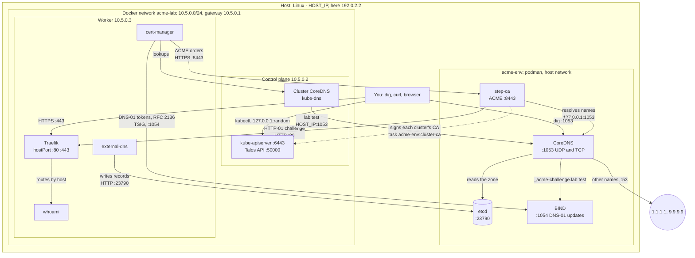

# Architecture

How the two labs are built, which networks they use, and how a DNS record
and a certificate get from one to the other. The diagram shows a Linux host
with both labs up: acme-env in podman, talos-cluster in Docker.

## Overview

## Networks

| Network | Address | What is on it |
|---|---|---|
| The host | `HOST_IP`, the source address of the default route | acme-env's three services, which use the host network. Containers and nodes reach them here. |
| `acme-lab`, a Docker bridge | `10.5.0.0/24`, the host is `10.5.0.1` | The Talos nodes: control plane `.2`, workers from `.3`. The host reaches the nodes directly; the nodes reach the host at `HOST_IP`. |
| Pod network, flannel | `10.244.0.0/16` | Pods. Traffic to the host leaves through the node's address. |
| Service network | `10.96.0.0/12` | Cluster services, such as kube-dns at `10.96.0.10`. |

acme-env uses the host network so that its addresses are the host's own:
the CA's certificate, the DNS answers and external-dns all use `HOST_IP`,
which works from the host, from containers and from the cluster.

## Ports

| Port | Listens on | Service | Used by |
|---|---|---|---|
| 1053, UDP and TCP | all host addresses | CoreDNS of acme-env | step-ca, the cluster's CoreDNS, you |
| 8443 | all host addresses | step-ca: ACME and `/health` | cert-manager, lego, you |
| 23790 | all host addresses | etcd, client API | external-dns, `task acme-env:record-add` |
| 23800 | `127.0.0.1` | etcd, peers | etcd alone |
| 1054, UDP and TCP | all host addresses | BIND: the zone `_acme-challenge.<zone>`, and RFC 2136 updates signed with TSIG | CoreDNS of acme-env, cert-manager, lego |
| 80, 443 | `10.5.0.3` | Traefik, as hostPorts on the worker | step-ca for HTTP-01, you |
| 6443 | `10.5.0.2`, and a random port on `127.0.0.1` | Kubernetes API | kubectl, through `.run/kubeconfig` |
| 50000 | `10.5.0.2` | Talos API | talosctl, through `.run/talosconfig` |
| 80 | all host addresses, during `task acme-env:check` | lego's challenge server | step-ca |

## Flows

**A DNS record from the cluster.** An Ingress for `whoami.lab.test` gets the
worker's address as its status: Traefik sets it from
`ingressEndpoint.ip`, because Docker has no LoadBalancer. external-dns sees
the Ingress and writes two keys into etcd at `HOST_IP:23790`: the A record
`/skydns/test/lab/whoami` and a TXT record that names the owner, the cluster
`acme-lab`. When the Ingress goes, external-dns deletes both.

**A lookup.** CoreDNS of acme-env answers `ca.lab.test` from its own
`hosts` block and every other name in `lab.test` from etcd. Names outside
the zone go to `1.1.1.1` and `9.9.9.9`. A pod asks the cluster's CoreDNS,
which forwards `lab.test` to `HOST_IP:1053` and everything else as
Talos sets it up.

**A certificate.** cert-manager sees the annotation
`cert-manager.io/cluster-issuer: step-ca` and orders a certificate from
`https://ca.lab.test:8443`, trusting the root from the issuer's `caBundle`.
It creates a small solver pod and Ingress that serve the challenge under
`/.well-known/acme-challenge/`, and checks for itself that the URL answers.
step-ca then resolves the name through CoreDNS at `127.0.0.1:1053`, fetches
the challenge from the worker on port 80, and issues the certificate.
cert-manager stores it in the Secret `whoami-tls`, and Traefik serves it a
few seconds later. On a GitHub runner this takes about 20 seconds.

**A wildcard certificate.** Only DNS-01 can prove `*.lab.test`: the token
goes in a TXT record at `_acme-challenge.lab.test`. CoreDNS cannot take
updates, so BIND holds that one zone, and CoreDNS forwards it there.
cert-manager sends the token to BIND at `HOST_IP:1054` as an RFC 2136
update, signed with the TSIG key `lab-dns01`; BIND refuses updates without
it. cert-manager checks through CoreDNS that the token is there, step-ca
looks it up the same way and issues the certificate, and cert-manager
removes the token. The demo's Ingress `hello` serves the certificate from
the Secret `wildcard-tls`.

**The cluster's CA.** Before it creates a cluster, `task talos-cluster:up`
has acme-env sign a CA for it with the root, in a throwaway container with
the CA's volume. Config patches give Talos that CA in place of the one
talosctl generates: the control plane issues from it, and every node trusts
it alone. The API server's certificate and the cluster's client
certificates, such as the one in `.run/kubeconfig`, chain to the root
through it.

**HTTPS from the host.** `curl --cacert .run/root_ca.crt` connects to
`10.5.0.3:443`. Traefik picks the certificate by the name and routes to
whoami.

**The acme-env test.** `task acme-env:check` writes `smoke.lab.test` with the
host's address into etcd and runs lego on the host, listening on port 80.
step-ca resolves the name and fetches the challenge from the host itself.

## Certificates

| Certificate | Made by | Valid for | Trusted through |
|---|---|---|---|
| Root, "Lab Internal CA Root CA" | `task acme-env:up`, once | 10 years | `task acme-env:trust`, `caBundle`, `--cacert` |
| Intermediate, "Lab Internal CA Intermediate CA" | the same | 10 years | the root |
| step-ca's own TLS | step-ca, at start | 24 hours, renewed by step-ca | the root |
| An app's, such as `whoami.lab.test` | ACME over HTTP-01, per name | 24 hours | the root; cert-manager renews it |
| The wildcard, `*.lab.test` | ACME over DNS-01 | 24 hours | the root; cert-manager renews it |
| A cluster's CA, such as "acme-lab Kubernetes CA" | `task acme-env:cluster-ca`, signed by the root | 5 years | the root |
| The API server's and the cluster's client certificates | Talos, from the cluster's CA | as Talos sets them | the cluster's CA, then the root |

step-ca's default is 24 hours, so certificates turn over every day.
cert-manager renews at two thirds of the lifetime.

## Start order

acme-env first: `task talos-cluster:up` stops at once when step-ca does not
answer on `HOST_IP`. When acme-env stops while the cluster runs, the
cluster's lookups in `lab.test` fail and renewals wait; they pick up again
after `task acme-env:up`, with the same CA and records.
