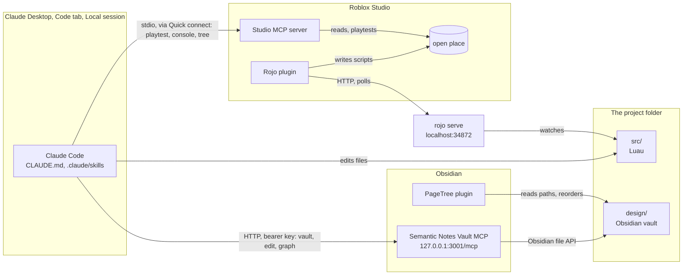

# Architecture

How the parts of a roblox-gdd project fit together, how Claude reaches each
one, and why a change goes the way it does.

## Overview

## The parts

| Part | Runs where | Claude reaches it by | Port |
|---|---|---|---|
| Claude Code | Claude Desktop, Code tab, **Local** environment | the session | none |
| `src/` | the project folder | file edits | none |
| `rojo serve` | the session's terminal | file edits it watches | 34872, Rojo's default |
| Rojo plugin | Roblox Studio | through `rojo serve` | none |
| Studio MCP server | Roblox Studio | the `Roblox_Studio` MCP server, added with Quick connect | stdio |
| `design/` | the project folder, opened as a vault | the `obsidian` MCP server | none |
| Semantic Notes Vault MCP | inside Obsidian | `.mcp.json`, HTTP | 3001 |
| PageTree | inside Obsidian | nothing directly; it follows the files | none |

## The flows

**Code goes one way.** Claude edits a file under `src/`. `rojo serve` sees
the change, and the Rojo plugin in Studio pulls it into the place. Studio is
never the source: an edit made there, by hand or through the Studio MCP, is
overwritten at the next sync and is not in git. This is why the
`roblox-studio-mcp` skill uses Studio only to look and to playtest.

**Pages go through Obsidian.** Claude changes `design/` through the
`obsidian` MCP server. The plugin calls Obsidian's own file API, so a rename
fires the same event as a rename by hand. PageTree hears it and renames the
child folder, and Obsidian updates the `[[links]]`. A file renamed or
moved behind Obsidian's back looks to PageTree like a delete and a new
file.

**PageTree's tree is the file tree.** A page `X.md` keeps its children in
the folder `X/` next to it. PageTree adds nothing to the notes, so the vault
stays plain Markdown that Claude, git and `check-gdd.sh` can read. Only the
order of siblings is PageTree's own, in `.obsidian/plugins/page-tree/data.json`.
`.mcpignore` keeps the MCP away from it.

**The network contract has three copies.** A remote is declared in
`src/shared/Remotes.luau`, documented as `### Name` in
`design/Game/Networking.md`, and drawn as an edge in
`design/Game/Networking.canvas`. `check-gdd.sh` compares the first two. The
canvas is checked by eye, and by `task roblox-gdd:check` for the template
only.

**A playtest closes the loop.** With `rojo serve` connected, Claude starts
play through the Studio MCP and reads the console. It stops play, fixes the
file under `src/`, and repeats until the console is clean.
