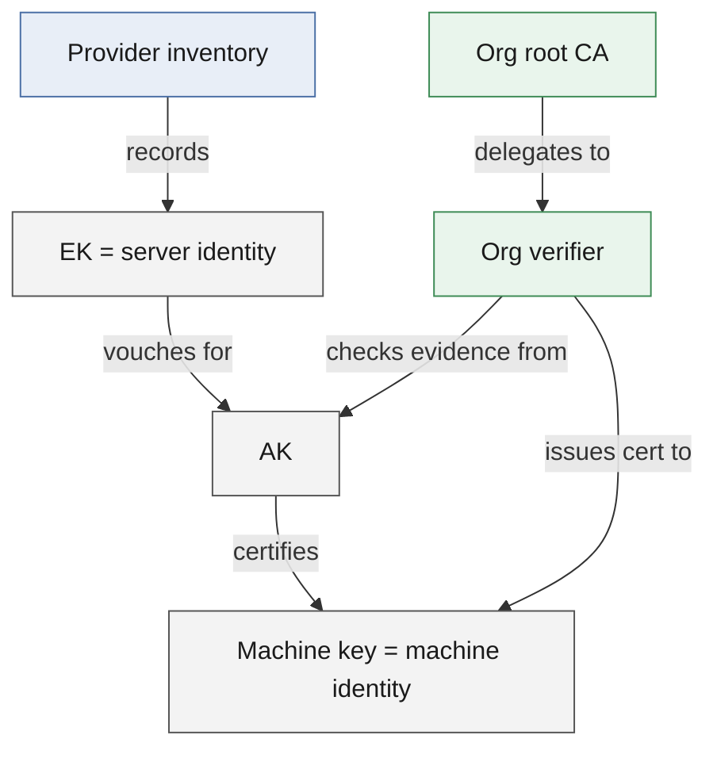
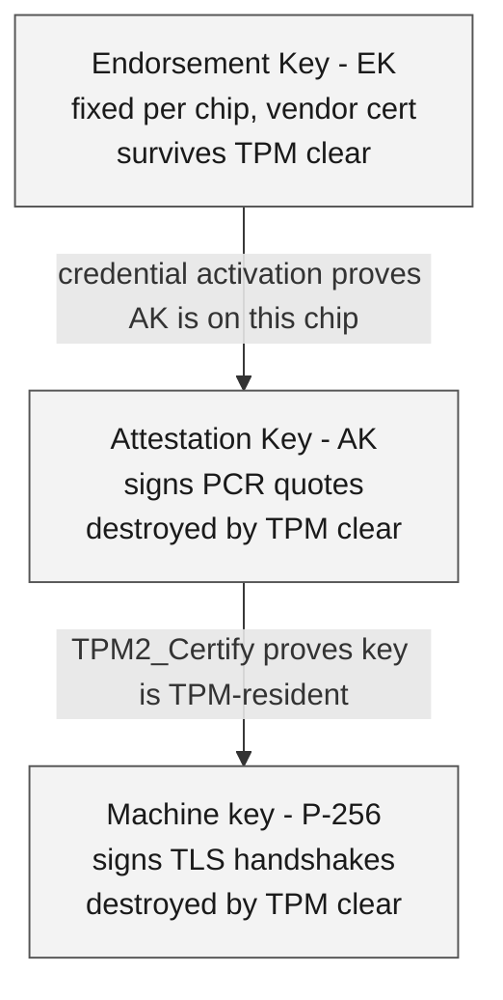
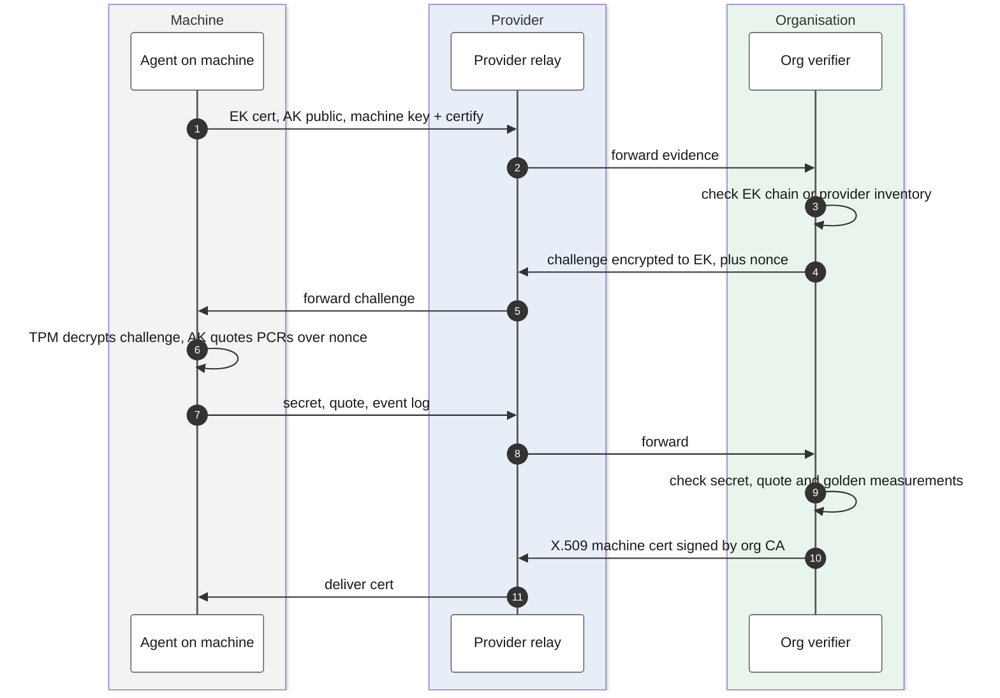
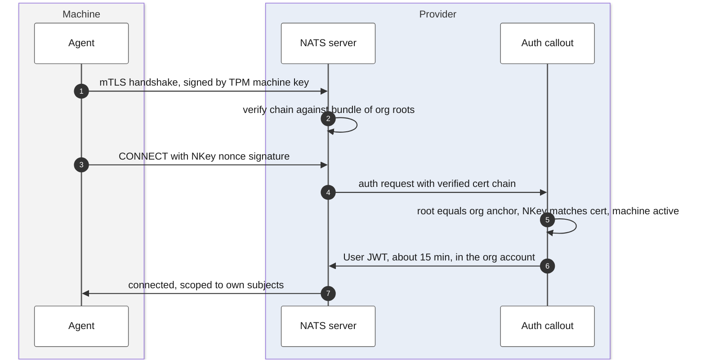
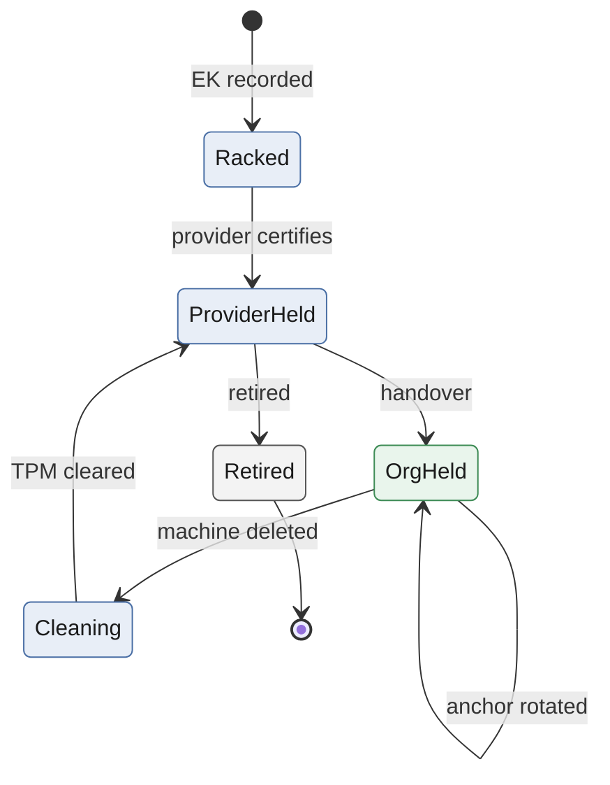
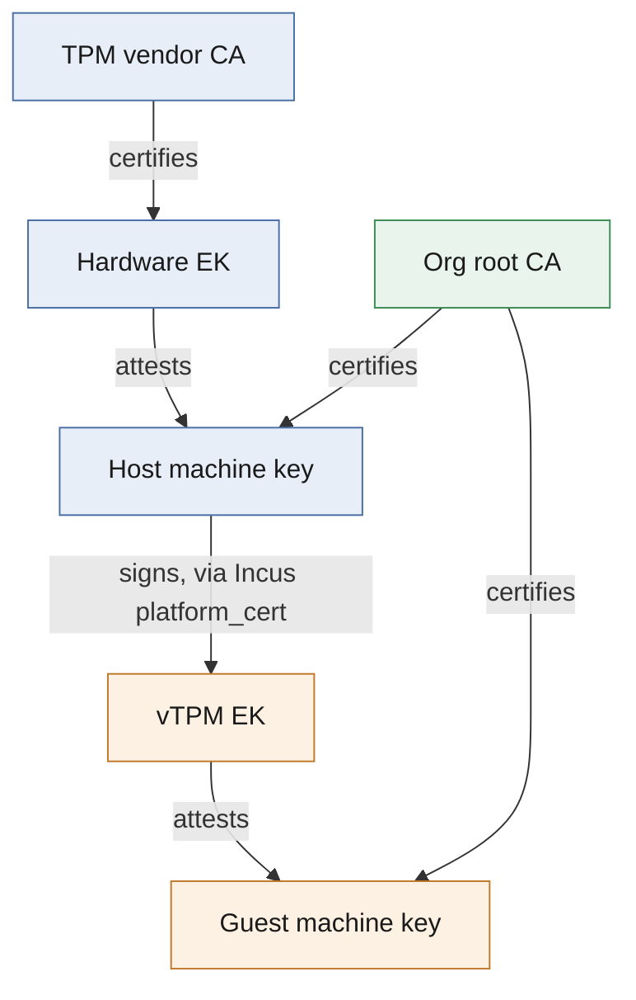

# TPM-rooted machine identity: core concepts illustrated

A visual companion to *tpm-machine-identity-brief.md*. Each diagram shows one idea.

## 1. Who owns what

The provider owns the hardware and its identity. The organisation owns the machine identity, because only the organisation's CA can certify it.

Blue is the provider, grey is inside the server's TPM, and green is the organisation.

## 2. The key chain inside the TPM

Three keys, three jobs. The EK says "genuine TPM", the AK says "this is what booted", and the machine key is the identity that gets used.

## 3. Enrollment: the organisation vouches

The provider only relays. Every piece of evidence is signed by the TPM or encrypted to it, so the relay cannot tamper undetected.

## 4. Runtime: connecting to NATS

The TLS handshake proves the agent holds the TPM key. The callout then checks that the certificate chains to the right organisation before granting a short-lived NATS identity.

## 5. Server lifecycle: authority moves between anchors

The same mechanism runs under two different anchors. Only the TPM clear at the end of a tenure separates one organisation's machine from the next.

Blue states are when the provider holds authority over the server, and green is when the organisation does.

- **EK recorded:** the server's EK goes into the provider inventory at racking.
- **Handover:** the org verifier attests the server and certifies a new machine key.
- **Anchor rotated:** the org re-issues the cert over the same TPM key.
- **TPM cleared:** the AK and machine key are destroyed; the EK is kept.

## 6. Physical vs virtual TPM

The protocol is the same. Only the answer to "who vouches that the TPM is genuine" changes.

Blue is the physical server, orange is the VM, and green is the organisation.

**Trust summary:**

- **Physical TPM:** you trust the TPM vendor and the hardware.
- **vTPM on an org-held server:** the host is already org-certified, so no new trusted party is added.
- **vTPM on a provider-held host:** the provider host is trusted, unless the guest runs as a confidential VM (SEV-SNP or TDX).

## 7. What each layer protects

| Layer | Protects against | Does not protect against |
|---|---|---|
| EK and vendor cert | Fake or emulated TPMs | Provider choosing which genuine server to use |
| AK quote | Tampered firmware, bootloader or OS | Runtime compromise after a good boot |
| Org-issued machine cert | Provider forging a machine identity | Physical attack with BMC access |
| TPM-sealed disk | Disk cloning, offline extraction | Root access on a running, correctly booted node |
| Short-lived NATS JWT | Long-lived credential theft | Abuse within the 15-minute window |
